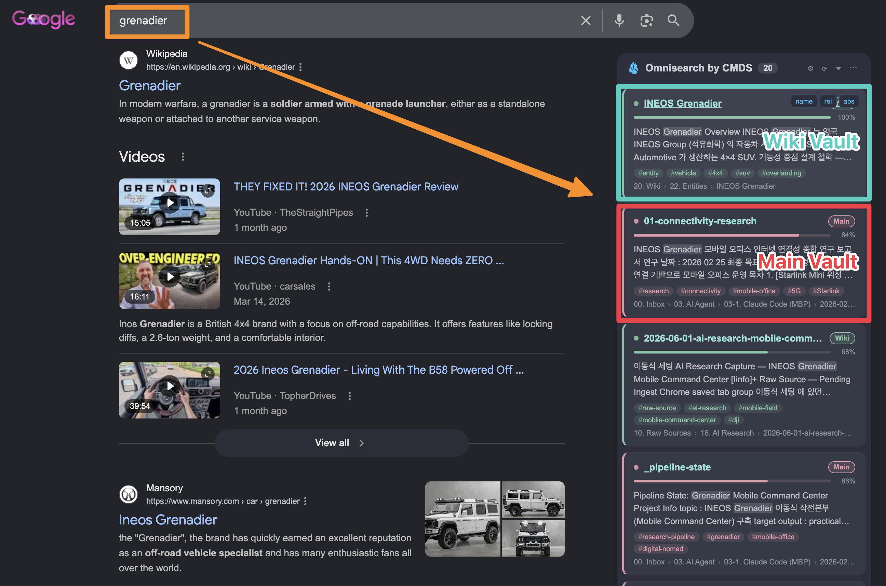
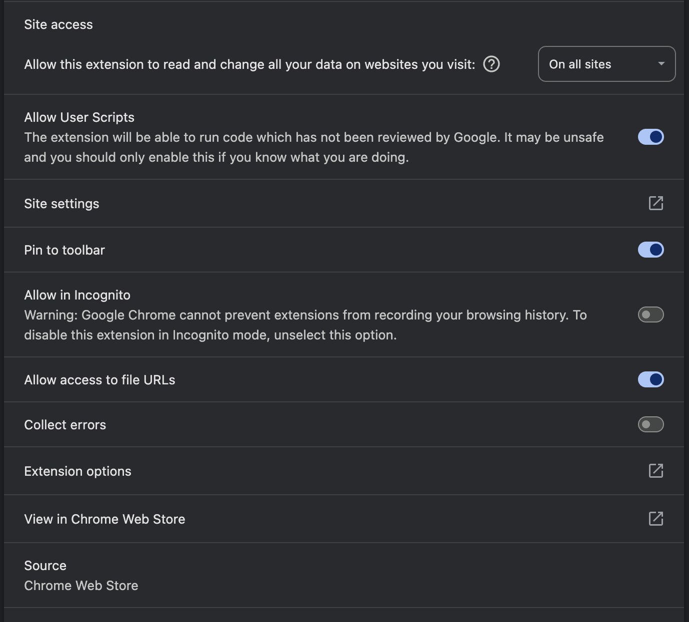

# Obsidian Omnisearch in Google — CMDS

A Tampermonkey/Violentmonkey **userscript** that injects your [Obsidian](https://obsidian.md) [Omnisearch](https://github.com/scambier/obsidian-omnisearch) results into the Google search sidebar — with **multi-vault** support, relevance bars, real body previews + tags via Local REST API, per-vault colors, themes, and keyboard navigation.

It extends Obsidian's search one layer outward: instead of opening the app to search your notes, your vault answers **right beside Google**, so external web knowledge and your own second brain show up in a single query.

> **Credit / attribution**: This is a fork of **Simon Cambier's** original *"Inject Omnisearch results into your search engine"* userscript ([scambier/userscripts](https://github.com/scambier/userscripts), part of the [Omnisearch](https://github.com/scambier/obsidian-omnisearch) project). All credit for the original idea and base implementation goes to the original author. This fork (by 구요한 / CMDSPACE) heavily extends it.

## Demo

**What you're seeing** — one search for `grenadier`, two knowledge bases answering at once:

- **Left** — Google's normal web results (Mansory, Car and Driver, Instagram…).
- **Right** — the Omnisearch sidebar injected by this script, showing notes from **two Obsidian vaults simultaneously**:
  - 🟢 **Wiki Vault** (teal) — the compiled LLM-wiki: `INEOS Grenadier` entity page, AI research notes.
  - 🔴 **Main Vault** (red/pink) — the personal mothership: `01-connectivity-research`, `_pipeline-state`, the Korean entity note.
- Each card shows a **relevance bar + %** (BM25, normalized to the top hit), a **body preview** (frontmatter stripped, real note text via Local REST API), **tags**, the **vault badge**, and the **path breadcrumb**. Click a card to open the note straight in Obsidian.

The vault color (teal vs red) carries through the whole card — title dot, badge, relevance bar — so you can tell at a glance which knowledge base a result came from.

## Install
1. Install [Tampermonkey](https://www.tampermonkey.net/) (or Violentmonkey) in your browser.
2. Click the raw script to install:
   **[`obsidian-omnisearch-google-cmds.user.js`](https://raw.githubusercontent.com/johnfkoo951/obsidian-omnisearch-google-cmds/main/obsidian-omnisearch-google-cmds.user.js)**
3. In Obsidian, install **Omnisearch** and enable its HTTP server (Settings → Omnisearch → "HTTP server").
4. Search on Google → results appear in the right sidebar.

## Chrome / Tampermonkey permissions

On recent Chrome, userscripts won't run until you flip a couple of toggles. Open `chrome://extensions` → **Tampermonkey** → **Details**:

- **Allow User Scripts** → **ON** (required). Chrome 138+ gates userscript execution behind this toggle; if it's off, nothing appears.
- **Site access** → **On all sites** (or at least allow `google.com`). The widget injects into Google's results page.
- **Allow access to file URLs** → ON is fine (harmless here; this script talks to `http://localhost`, not `file://`).
- **Allow in Incognito** → optional, only if you want it there too.

**First search** also triggers a Tampermonkey cross-origin prompt for `localhost` / `127.0.0.1` (the local Omnisearch / Local REST API calls). Choose **Always allow domain**.

> Firefox/Violentmonkey users: no "Allow User Scripts" toggle — just make sure the script is enabled and has access to `google.com`.

## Features
- **Multi-vault** fan-out — query several open vaults at once (one Omnisearch HTTP port per vault), merged and sorted by relevance, with per-vault badges/colors.
- **Relevance bars** (normalized BM25 score) + min-relevance filter, sort, type filters, in-widget refine.
- **Body preview + real tags** via the optional [Local REST API](https://github.com/coddingtonbear/obsidian-local-rest-api) plugin (strips frontmatter, shows actual note body + tags).
- **Reliable open** — opens notes via Local REST `POST /open` (works across background vault windows); falls back to `obsidian://` deeplink (with Advanced URI option).
- **Themes** (9), **card skins** (Clean/Tinted/Solid/Flat), per-vault color scope, keyboard nav (`j/k/Enter/y`), copy note name / relative / absolute path.

## How it works
- The Omnisearch plugin exposes a local **HTTP search endpoint** per vault. The script queries every configured port in parallel and merges the results by relevance — that's how **multiple vaults** appear together.
- With the **Local REST API** plugin enabled per vault, the script also fetches each result's real note (`application/vnd.olrapi.note+json`) to show frontmatter-free body previews and actual tags, and opens notes via `POST /open` for reliable cross-window opening.
- In short, your vault becomes a small **queryable knowledge service**, and the browser is just another client of it.

## Configuration
Open Tampermonkey → this script → **Settings**. Each vault is a slot (Port / display name / deeplink vault name / color / filesystem root / Local REST port + key). General settings cover results count, themes, skin, vault-color scope, etc. Hover any label for a Korean tooltip.

> Tip: for multi-vault, open each vault in its own Obsidian window and give each one a distinct Omnisearch HTTP port (and, if you use Local REST API, enable its non-encrypted HTTP server with a distinct port per vault).

## Changelog

Versions track the `@version` in the userscript header (newest first).

- **v0.13.1** — Default theme set to **Ocean**; fixed "Note title color" not applying in Accent scope.
- **v0.13.0** — Harmonious default vault colors (Main `#E39AAB` dusty rose / Wiki `#86C2A6` sage); header text/count/icons toned down to neutral white-gray (logo keeps the accent color).
- **v0.12.1** — **`vaultColorScope`** (Accent / Full): Accent keeps titles readable and applies the vault color only to accents; Full colors titles + highlights too.
- **v0.12.0** — **9 theme presets** (CMDS / Obsidian / Mono / Ocean / Forest / Sunset / Rose / Grape / Slate), light & dark auto.
- **v0.11.1** — Vault color unified across the whole card (title dot, badge, relevance bar, highlight, tags) so each card reads as one vault at a glance.
- **v0.11.0** — Open notes via **Local REST `POST /open`** (reliable across background vault windows, falls back to deeplink); **4 card skins** (Clean / Tinted / Solid / Flat).
- **v0.10.1** — Local REST port field accepts port / `host:port` / full URL; console diagnostics (401 / connection / timeout); `@connect localhost,127.0.0.1`.
- **v0.10.0** — **Local REST API integration**: real frontmatter-free body previews + actual tags; lazy enrichment of visible results.
- **v0.9.6** — Fixed Korean hover tooltips in the settings panel.
- **v0.9.5** — Settings UI cleanup (calmer section headers, "General" divider, fixed Save/Close bar, label tooltips); stronger frontmatter stripping; better tag extraction.
- **v0.9.4** — `vaultsParentDir` to auto-build absolute paths for "copy abs path".
- **v0.9.3** — Diagnosed the real "vault opens but note doesn't" cause (Obsidian multi-window limitation); **Advanced URI** recommended for background vaults.
- **v0.9.2** — Strip the `.md` extension when building the `obsidian://open` deeplink.
- **v0.9.1** — Split per-vault settings into slots (port / name / deeplink vault / color / root); no hardcoded paths; Advanced URI option.
- **v0.9.0** — Per-port deeplink vault name + color; per-vault card/badge/dot colors; long-title vs badge layout fix; header "Omnisearch by CMDS"; copy name/rel/abs; tag entity-fragment fix; min-relevance step 1.
- **v0.8.0** — Per-port vault labels; custom title/accent colors; tag + matched-term chips.
- **v0.7.0** — **Multi-vault fan-out**; relevance bars + min-relevance filter; live refine/sort/type controls; per-result copy actions; keyboard nav; collapsible widget; themes.
- **v0.6.x** — CMDS brand colors; UI redesign; fixed double-escaped entities & frontmatter noise.
- **v0.5.0** — URL / regex / HTML escaping; defensive response parsing.
- **v0.4.2** — Starting point: fork of Simon Cambier's original userscript.

Built iteratively with Claude Code (v0.4 → v0.13).

## License
This fork is released under the **MIT License** (see `LICENSE`).
The original userscript by Simon Cambier carries **no explicit license**; this fork retains author attribution and links back to the source out of respect for the original work. If the original author objects to redistribution, please open an issue.
